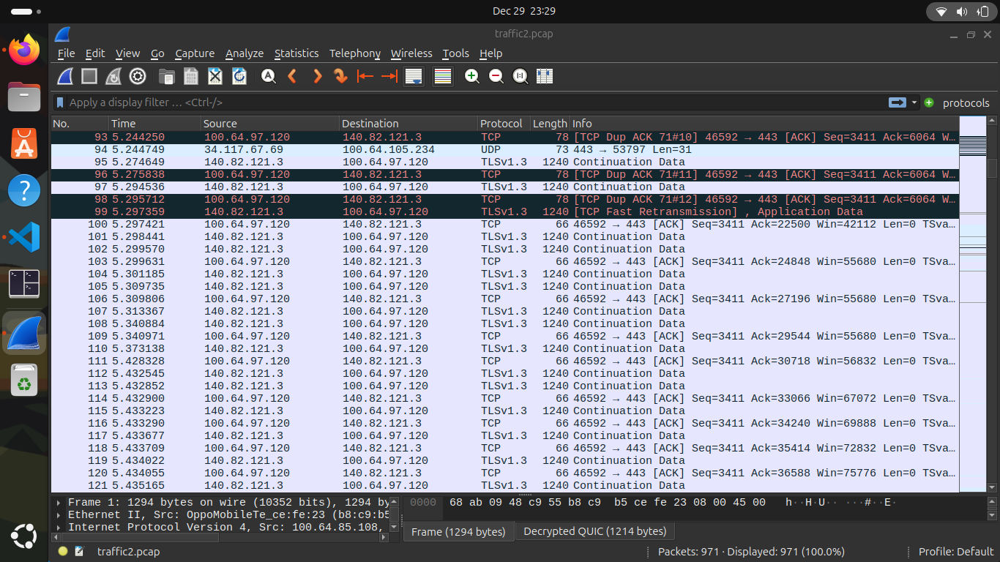
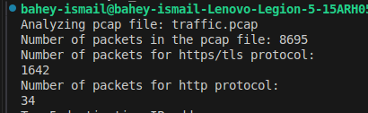

pcap network traffic analyzer

r0: capture network interactions from wireshark

r1 : total packets count and protocols in the pcap file

r2 : ip's with most num of  destination packets and source packets 

